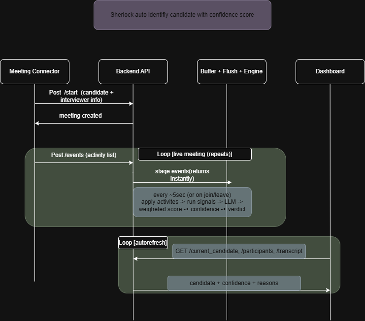
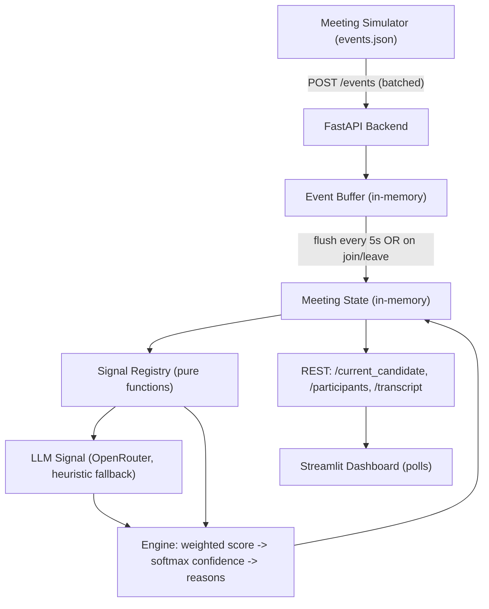

# Sherlock Candidate Detector

Identify **which live-meeting participant is the interview candidate**, in real
time, with a **continuously-updated confidence score** that **explains itself**
and **degrades gracefully** under bad or missing data.

Meeting metadata is unreliable in the real world: candidates join as their
device ("MacBook Pro", "iPhone"), interviewers type the wrong name at
scheduling time, people use nicknames, observers stay silent, and participants
rename themselves mid-call. Rather than trust any single rule, this system
**fuses many weak signals** — name/email match, self-introductions,
conversation role (asking vs. answering), speaking time, camera state, join
order, and a holistic LLM read — into one ranked, explainable verdict.

---

## Simpler Overview of the flow

https://app.diagrams.net/#G1wxw_qEXdyZOYF3n1TLyO4iQHRX-FJDYw#%7B%22pageId%22%3A%22gxAINaLU5uSzyIaGaOXu%22%7D

## Architecture



**Design in one line:** events carry only *deltas*; the engine recomputes every
signal as a **pure function of accumulated state** on each flush. This kills a
whole class of double-counting bugs and makes the scenarios below trivially
testable (feed state, assert the winner).


### Components

| File | Responsibility |
| --- | --- |
| `app/main.py` | FastAPI app; 4 core routes + `/transcript` + `/health`; background flush wired via `lifespan`. |
| `app/models.py` | Pydantic models (`Event`, `Participant`, `Meeting`, request/response schemas). |
| `app/meeting_state.py` | In-memory, lock-guarded meeting registry + `apply_event` (the only place state mutates). |
| `app/buffer.py` | Async buffer that flushes every `N` seconds, and immediately on JOIN/LEAVE. |
| `app/signals.py` | Independent, pure weak-signal detectors + registry. |
| `app/llm.py` | LLM signal via OpenRouter, with a deterministic offline heuristic fallback. |
| `app/engine.py` | Fuses signals: weighted score → softmax confidence → ambiguity flag → reasons. |
| `frontend/dashboard.py` | Streamlit dashboard that polls the REST API. |
| `simulator/` | Replays a scripted interview (`events.json`) against the API. |
| `tests/` | Offline scenario evaluation (this deliverable). |

---

## Setup

Requires Python 3.10+.

```bash
cd candidate-detector
python -m venv .venv
# Windows:      .venv\Scripts\activate
# macOS/Linux:  source .venv/bin/activate
pip install -r requirements.txt
```

Optional — enable the live LLM signal (otherwise a deterministic heuristic is
used, and everything still works fully offline):

```bash
cp .env.example .env      # then paste a free key from https://openrouter.ai/keys
```

### Run the backend

```bash
uvicorn app.main:app --reload
```

Interactive API docs (Swagger UI) are auto-generated at
<http://localhost:8000/docs>.

### Run the dashboard

```bash
streamlit run frontend/dashboard.py
```

### Drive it with the simulator

```bash
python simulator/simulator.py
```

---

## API

| Method & path | Purpose |
| --- | --- |
| `POST /start` | Initialise a meeting with interview metadata (candidate name/email, interviewer names/emails, schedule). |
| `POST /events` | Submit a batch of delta events (join/leave, rename, camera, screen-share, speaking, transcript). Buffered. |
| `GET /current_candidate` | Current best guess: `{candidate_id, display_name, confidence, reasons, ambiguous}`. |
| `GET /participants` | Every participant, ranked, with score / confidence / reasons. |
| `GET /transcript` | Recent transcript lines with speaker attribution (powers the dashboard). |

---

## Signals

Each signal is a pure function `signal(meeting) -> {participant_id: (score, reason)}`
where `score` is a roughly `[-1, +1]` opinion (positive ⇒ *more* likely the
candidate). The engine applies per-signal weights and normalises.

| Signal | Weight | What it captures |
| --- | --- | --- |
| `name_signal` | 1.5 | Fuzzy name/email match vs. candidate (positive) vs. interviewer (negative); device-like names are treated as **uninformative (0)**, not misleading. |
| `intro_signal` | 1.5 | Self-introduction in the transcript ("my name is …", "I'm …"); boosted when the introduced name matches the expected candidate. Robust to a wrong display name. |
| `conversation_signal` | 1.2 | Interviewers *ask*, candidates *answer* (question ratio + prompting phrases). |
| `speaker_signal` | 1.0 | Rewards substantial (not zero, not lone-monologue) speaking share; near-silence ⇒ observer. |
| `camera_signal` | 0.5 | Small positive for camera-on (candidates are usually asked to enable it). |
| `join_signal` | 0.5 | Mild timing nudge: the first joiner is usually the host/interviewer. |
| `llm_signal` | 2.0 | Holistic read via OpenRouter; **falls back** to a deterministic heuristic offline. |

**Score → confidence → explanation:** the engine takes a weighted sum, converts
scores to a probability-like share with a softmax (so confidence *drops when two
people score similarly*), flags `ambiguous` when the top two are within a small
margin, and collects each leader's positively-contributing reasons for a
free, self-explaining verdict.

---

## Assumptions & trade-offs

- **In-memory state, single process.** No database or broker — the challenge is
  about detection quality, not persistence. State lives in a lock-guarded
  registry; restart clears it.
- **Deltas only.** Events are treated as deltas applied to accumulated state;
  signals recompute from that state each flush (idempotent, no `+=` drift).
- **Graceful degradation is a feature, not an afterthought.** Missing metadata,
  device names, wrong names, and unparseable LLM replies all fall back to
  something sensible rather than crashing or guessing confidently.
- **The LLM is one weak signal, not the answer.** With no API key the system
  runs entirely offline on the deterministic heuristic; the LLM only *adds*
  weight when available. A single failing signal is caught and skipped.
- **Weights are hand-tuned, not learned.** They live in `engine.py`
  (`DEFAULT_WEIGHTS`) and are overridable via config; no labelled training data
  is assumed.

### Known limitations

- Heuristics are tuned for English-language interview phrasing.
- Speaking time is trusted as reported; no speaker-diarisation is performed.
- Two genuinely candidate-like participants will correctly surface as
  `ambiguous` (low confidence) rather than a forced pick — by design.

---

## Evaluation

The `tests/` directory doubles as the challenge's evaluation. It contains three
scripted edge-case scenarios plus a pytest suite that replays each one through
the **real** pipeline (`meeting_state` → `signals` → `engine`) and asserts the
correct candidate is identified.

The suite runs **fully offline and deterministically**: the network LLM call is
patched out so the heuristic fallback runs every time, meaning the tests pass
with no API key and give the same result on every run.

| Scenario | Edge case | Expected result |
| --- | --- | --- |
| `scenario1` | Candidate joins under a **device name** ("MacBook Pro"). | Behaviour (self-intro + answering + speaking time) wins despite a useless display name. |
| `scenario2` | Interviewer typed the **wrong candidate name** ("Sameer" vs. real "Arjun Nair"); a silent room device is present. | Behaviour overrides the misleading name; the silent observer is demoted. |
| `scenario3` | **Multiple interviewers** + **silent observers** (note-taker, phone). | The single real candidate is separated from several interviewers *and* observers at once. |

Each scenario JSON declares its `start` metadata, delta `events`, and the
`expected` winner (with optional `min_confidence` and `ambiguous` assertions),
so new edge cases can be added by dropping in another `scenarioN.json` — no test
code changes required.

### Run the tests

```bash
cd candidate-detector
python -m pytest tests -v
```

Expected:

```
tests/test_scenarios.py::test_scenario_identifies_expected_candidate[scenario1] PASSED
tests/test_scenarios.py::test_scenario_identifies_expected_candidate[scenario2] PASSED
tests/test_scenarios.py::test_scenario_identifies_expected_candidate[scenario3] PASSED
tests/test_scenarios.py::test_expected_candidate_ranks_first[scenario1] PASSED
tests/test_scenarios.py::test_expected_candidate_ranks_first[scenario2] PASSED
tests/test_scenarios.py::test_expected_candidate_ranks_first[scenario3] PASSED
tests/test_scenarios.py::test_scenario_files_present PASSED
```
